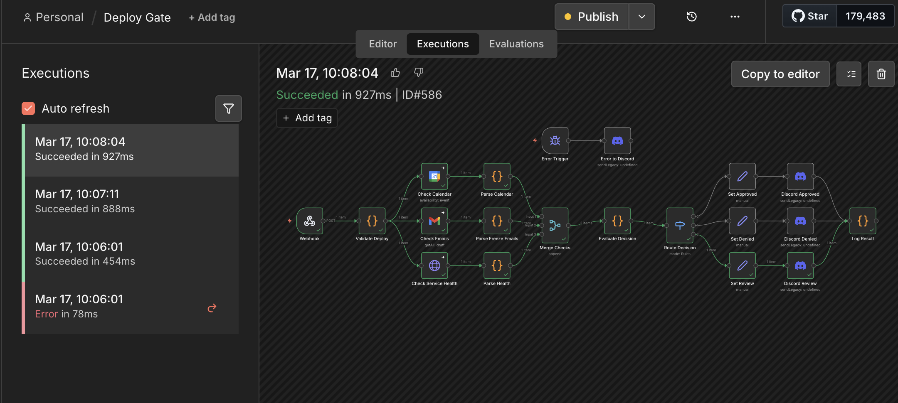

# Auto n8n Dev 

> Build, deploy, and debug n8n workflows from the terminal — described in plain English, generated by AI, running in production.

No drag-and-drop. No clicking. Just tell Claude what you want, and it builds it.

---

- [The idea](#the-idea)
- [See it in action](#see-it-in-action)
- [How it works](#how-it-works)
- [Getting started](#getting-started)
- [Your first AI-generated workflow](#your-first-ai-generated-workflow)
- [CLI reference](#cli-reference)
- [Claude Code skills](#claude-code-skills)
- [Built-in safety features](#built-in-safety-features)
- [Known limitations](#known-limitations)
- [Going deeper](#going-deeper)

---

## The idea

n8n is a powerful workflow automation platform. But building complex workflows through its UI is slow, hard to review, and impossible to automate.

This toolkit flips that model. A thin Python CLI wraps the n8n Public API, and a set of Claude Code skills load domain knowledge about every n8n node. You describe a workflow in plain English. Claude generates the full JSON, deploys it, triggers it, reads any errors, patches the workflow, and re-deploys — entirely from the terminal.

Your workflows live as versioned JSON files in `workflows/`. You can inspect them, diff them with `git`, and redeploy them in one command.

---

## See it in action



**What you're looking at:** The **Deploy Gate** — a 20-node production workflow built entirely by Claude Code from a single plain-English description.

Here is what it does:

1. A webhook receives a deploy request
2. It checks Google Calendar for active release-freeze windows
3. It scans Gmail for freeze announcements sent by the team
4. It pings your service health endpoints in parallel
5. It merges all three signals and routes to one of three outcomes: **Approved**, **Denied**, or **Needs Review**
6. It posts the decision to a Discord channel — with a global error handler that also notifies Discord if anything goes wrong mid-run

**The execution history on the left tells the full story.** One failed run (78ms — Claude caught a routing logic error), then three consecutive successes at 454ms, 888ms, and 927ms as it iterated on the JSON. Zero UI interaction from start to finish.

---

## How it works

```
Describe the workflow in plain English
            ↓
Claude generates the full workflow JSON
(nodes, connections, credentials, expressions)
            ↓
CLI deploys and webhook-activates it on your n8n instance
            ↓
CLI triggers the webhook with curl
            ↓
CLI fetches the execution report
(per-node status, output, errors, and timing)
            ↓
Claude reads the errors, patches the JSON, re-deploys
            ↓
Repeat until all nodes are green ✓
```

The key insight: the n8n execution API gives Claude complete visibility into every node's inputs, outputs, and errors — the same information a human would see in the UI, but delivered directly into the AI's context so it can self-correct.

---

## Getting started

### Prerequisites

- **Python 3.11+** — pinned via `.python-version`
- **[uv](https://docs.astral.sh/uv/)** — fast Python package and project manager
- **An n8n instance** with the public API enabled ([how to enable it](https://docs.n8n.io/api/))

### 1. Clone and install

```bash
git clone <repo>
cd n8n-automation
uv sync
```

### 2. Configure your instance

```bash
cp .env.example .env
```

Open `.env` and fill in two values:

```bash
N8N_HOST=https://your-n8n-instance.com
N8N_API_KEY=your-api-key-here
```

### 3. Verify the connection

```bash
uv run n8n_cli.py workflows list
```

If you see your workflows (or an empty list), you're connected and ready to go.

---

## Your first AI-generated workflow

Open Claude Code in this directory and paste a prompt like:

```
Build me a webhook workflow that receives a city name,
fetches the current weather from wttr.in, and posts a
summary to Discord.
```

Claude will:
1. Look up the relevant node docs from the `/n8n-skills` knowledge base
2. Generate the complete workflow JSON and save it to `workflows/`
3. Deploy it to your n8n instance and activate the webhook
4. Trigger it with `curl` and inspect the execution report
5. Fix any errors and re-deploy until every node is green

When it's done, you have a working workflow on your instance and a committed JSON file you can version-control, share, or redeploy anywhere.

---

## CLI reference

Every API operation is a single terminal command with a consistent pattern:

```bash
uv run n8n_cli.py <resource> <action> [args] [--options]
```

### Resources and actions

| Resource | Actions | Notes |
|----------|---------|-------|
| `workflows` | `list` `get` `create` `update` `delete` `activate` `deactivate` `webhook-activate` `transfer` `tags` `set-tags` `version` | `webhook-activate` does the full deactivate→reactivate cycle needed to register production webhooks; `version <id> <version-id>` restores a previous version |
| `executions` | `list` `get` `report` `delete` `retry` `stop` `stop-many` `tags` `set-tags` | `report` renders a human-readable per-node summary; `get --include-data` returns the full JSON |
| `credentials` | `list` `create` `update` `delete` `schema` `transfer` | `schema <type>` shows the required fields for any credential type |
| `tags` | `list` `get` `create` `update` `delete` | |
| `users` | `list` `get` `delete` `change-role` | |
| `variables` | `list` `create` `update` `delete` | Requires paid n8n license |
| `projects` | `list` `create` `update` `delete` `users` `add-users` `remove-user` `change-role` | Requires paid n8n license |
| `tables` | `list` `get` `create` `update` `delete` `rows` `insert-rows` `update-rows` `upsert-row` `delete-rows` | |
| `source-control` | `pull` | `--force` overwrites local changes |
| `audit` | `generate` | `--categories credentials database nodes filesystem instance` |

### The debug loop in practice

```bash
# 1. Deploy and activate
uv run n8n_cli.py workflows create workflows/my-workflow.json
uv run n8n_cli.py workflows webhook-activate <id>

# 2. Trigger
curl -X POST "https://your-instance/webhook/path" \
  -H "Content-Type: application/json" -d '{"key": "value"}'

# 3. Inspect
uv run n8n_cli.py executions list --workflow-id <id>
uv run n8n_cli.py executions report <exec-id>

# 4. Deep dive if something failed
uv run n8n_cli.py executions get <exec-id> --include-data

# 5. After patching, re-deploy and re-test
uv run n8n_cli.py workflows update <id> workflows/my-workflow.json
uv run n8n_cli.py workflows webhook-activate <id>
```

---

## Claude Code skills

Skills are loaded on demand — each loads only the docs for its own resource group, keeping Claude's context window lean.

| Skill | Purpose |
|-------|---------|
| `/n8n-workflows` | Create, update, activate, version, and manage workflows |
| `/n8n-executions` | Inspect, debug, retry, and stop executions |
| `/n8n-credentials` | List credential types and manage credentials |
| `/n8n-tags` | Manage workflow tags |
| `/n8n-users` | List and manage instance users |
| `/n8n-variables` | Manage instance variables *(paid license)* |
| `/n8n-projects` | Manage projects and team access *(paid license)* |
| `/n8n-tables` | Query and manage n8n data tables |
| `/n8n-audit` | Run a security audit on the instance |
| `/n8n-source-control` | Pull from the configured git remote |
| `/n8n-skills` | **542 node docs** + workflow templates + compatibility matrix — the knowledge base Claude uses when building workflow JSON |

---

## Built-in safety features

The CLI has guardrails built in so nothing is ever lost silently.

| Feature | What it does |
|---------|-------------|
| **Auto-backup** | Before any `update` or `delete`, the current server state is saved to `workflows/.backups/` |
| **Auto-webhookId** | `create` and `update` automatically inject UUIDs into webhook nodes that are missing one — n8n silently skips registering the production endpoint without it |
| **Execution report** | `executions report <id>` renders a clean per-node summary with status, timing, output, and errors — no raw JSON scrolling |
| **Workflow files** | Every deployed workflow is persisted to `workflows/` for `git diff`, review, and one-command redeploy |

---

## Known limitations

**Webhook activation** requires the `webhook-activate` command (a deactivate → reactivate cycle). A plain `activate` call may not register the production webhook endpoint with n8n.

**`respondToWebhook` nodes** crash when a workflow is triggered manually from the n8n editor UI. Use `responseMode: "onReceived"` on the Webhook node instead and rely on the execution API for observability.

**Variables and Projects** require a paid n8n license. Both endpoints return `403 Forbidden` on the community edition.

---

## Going deeper

`CLAUDE.md` is the full technical reference for Claude — and a useful read for anyone building workflows by hand:

- Webhook lifecycle in detail
- Execution API data structure (per-node fields, branch indexing)
- Workflow JSON format (connections, credentials, expressions)
- Code node gotchas (string escaping, multi-item flows, HTTP Request data replacement)
- `jsCode` string escaping rules for workflow JSON
